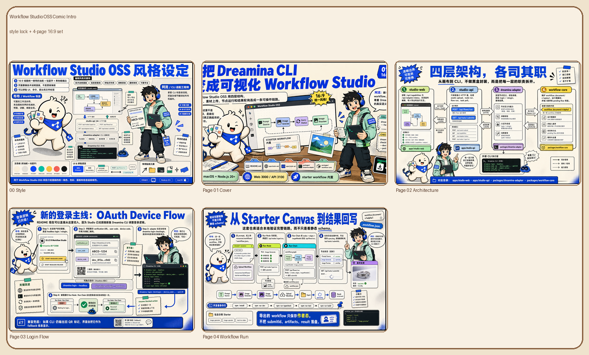
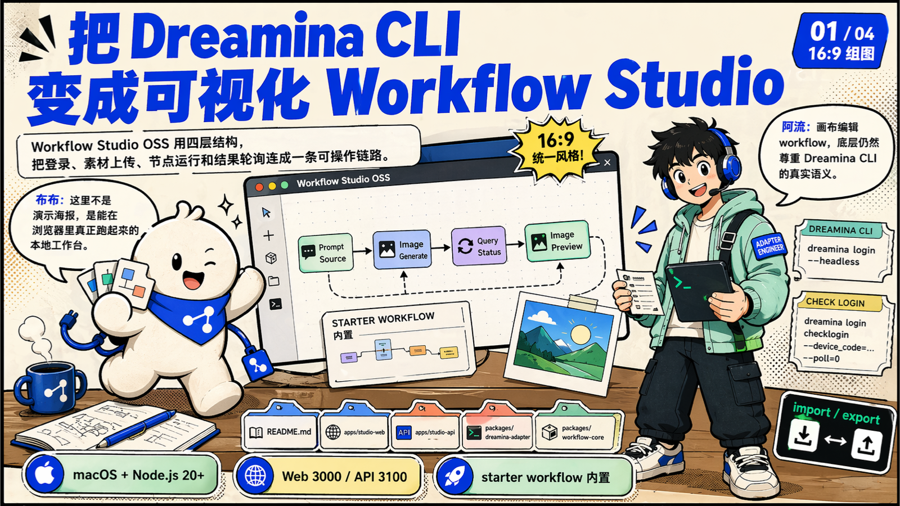
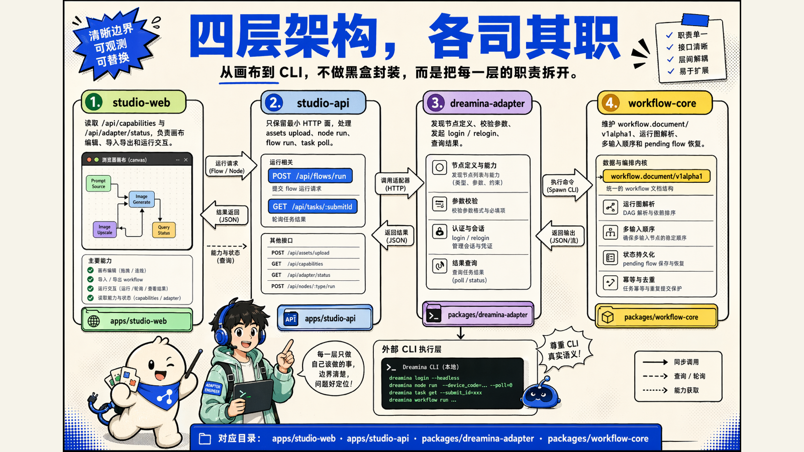
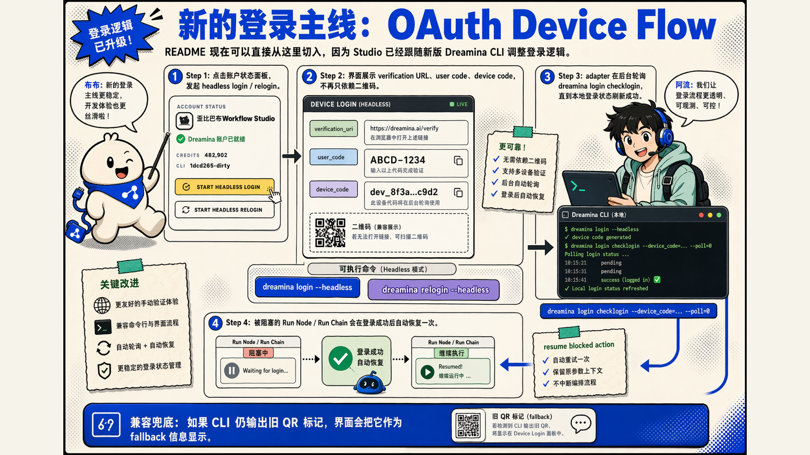
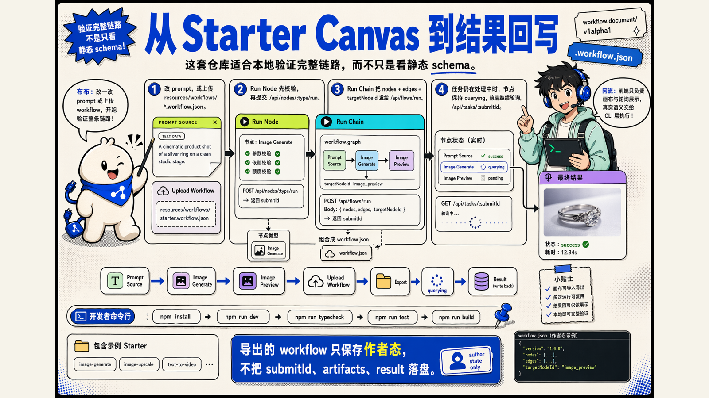
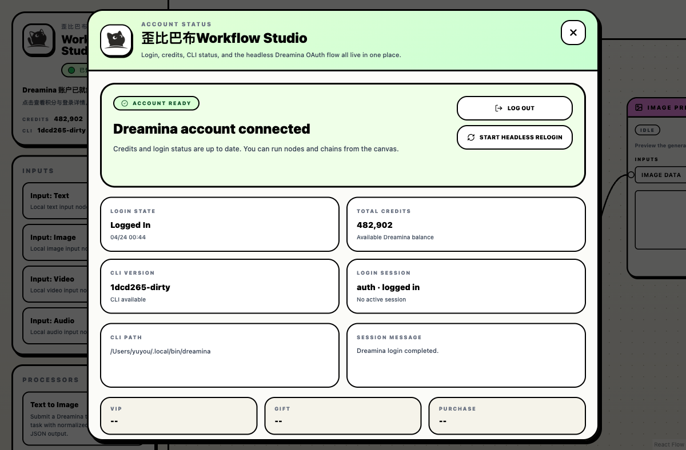
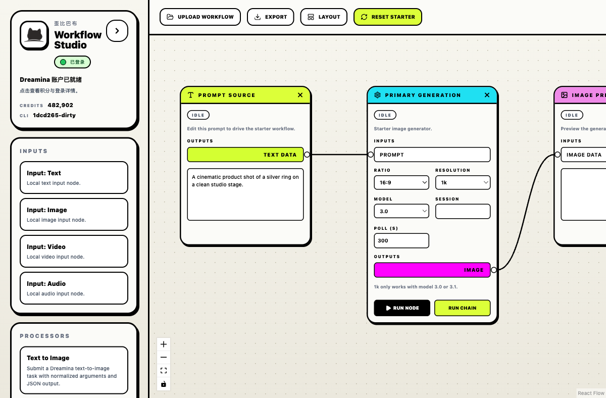

# Workflow Studio OSS

把 Dreamina CLI 包装成可视化 workflow studio 的开源示例仓库。这个仓库包含四层能力：`workflow-core` 负责 workflow schema 和执行语义，`dreamina-adapter` 负责把 Dreamina CLI 包装成可复用节点，`studio-api` 提供最小 HTTP API，`studio-web` 提供可交互的 React Flow 画布。最近一次对齐重点放在新版 Dreamina CLI 的 OAuth Device Flow 登录链路上，Studio 会直接展示 `verification_uri`、`user_code`、`device_code`，并在登录成功后自动恢复被阻塞的运行动作。



## 项目简介

这个项目适合你在本地快速验证三件事：

- 如何把 Dreamina CLI 组织成节点化 workflow
- 如何通过浏览器画布编辑、导入、导出和运行 workflow
- 如何把登录状态、素材上传、节点运行和结果轮询串成完整链路
- 如何把新版 Dreamina OAuth Device Flow 接进本地工作台，而不是只停留在 CLI 终端里

仓库内已经包含 starter workflow、示例 workflow、最小后端和前端界面，clone 后即可本地运行。

## README 导览组图

下面这组 16:9 组图会先带你看一遍项目，再往下看具体命令和说明：

<p align="center">
  
  
</p>
<p align="center">
  
  
</p>

这组图的源文件、风格包和分镜说明放在 `docs/comic-project-intro/` 目录下。

## 当前支持范围

- 当前仓库只在 `macOS` 上验证和支持
- Dreamina CLI 官方安装脚本本身支持多平台，但本仓库当前只提供 `macOS` 的开源使用说明
- 默认开发端口固定为 `3000`（Web）和 `3100`（API），启动前请先确保这两个端口空闲

## 环境要求

- `macOS`
- `Node.js 20+`
- `npm 10+`
- 本地可用的 `python3`

## 安装 Dreamina CLI

先安装 Dreamina CLI：

```bash
curl -fsSL https://jimeng.jianying.com/cli | bash
```

安装完成后，执行下面几条命令确认 CLI 已经准备好：

```bash
dreamina version
dreamina login -h
dreamina relogin -h
dreamina session -h
dreamina query_result -h
dreamina user_credit
```

说明：

- 新版 `dreamina login --headless` / `dreamina relogin --headless` 会打印 `verification_uri`、`user_code` 和 `device_code`
- 如果你想在终端里手动确认登录进度，可执行 `dreamina login checklogin --device_code=<device_code> --poll=30`
- Studio 的账户状态面板会直接读取这些字段，并在后台自动轮询 `dreamina login checklogin`
- 如果你是在运行 `Run Node` / `Run Chain` 时被登录拦住，登录成功后会自动恢复一次被阻塞的动作
- 如果命令无法执行，请先确认 Dreamina CLI 已经加入 `PATH`



## 安装项目依赖

在仓库根目录执行：

```bash
npm install
```

## 启动项目

```bash
npm run dev
```

启动成功后：

- Web: `http://127.0.0.1:3000`
- API: `http://127.0.0.1:3100`



## 第一次操作流程

1. 打开 `http://127.0.0.1:3000`
2. 进入默认的 starter canvas
3. 查看左上角账户状态卡，确认 Dreamina CLI 是否可用
4. 如果需要登录，点击状态卡并发起 headless 设备登录
5. 在画布中修改 starter workflow 的 prompt，或导入示例 workflow
6. 点击节点上的 `Run Node`，或点击链路上的 `Run Chain`
7. 等待结果回写到输出节点

## 示例 Workflow

仓库自带了几个可直接导入的示例：

- `resources/workflows/fanout-image-derivatives.workflow.json`
- `resources/workflows/three-image-branching.workflow.json`
- `resources/workflows/three-image-reference-video.workflow.json`

导入方式：

1. 启动项目
2. 点击顶部的 `Upload Workflow`
3. 选择 `resources/workflows/` 目录下的任意 `.workflow.json` 文件

## Dreamina CLI 对齐说明

- 所有生成节点现在都暴露可选的 `session` 参数；留空时由 Dreamina CLI 使用默认 session `0`
- 对于新版 CLI 明确支持“省略并走默认值”的字段，Studio 不再强行写死参数
- `image2video` 留空 `model_version` 时走基础路径；只有填写 `model_version` / `duration` / `video_resolution` 时才进入 advanced controls
- 登录流已切到 OAuth Device Flow：Studio 会读取 `verification_uri` / `user_code` / `device_code`，并在后台自动轮询 `dreamina login checklogin`
- 当前 UI / API 仍未直接暴露 `list_task`、`session create/list/search/rename/delete`；这些仍然是 CLI-first 能力

## 验证命令

在仓库根目录执行：

```bash
npm run typecheck
npm run test
npm run build
node ./scripts/migrate-workflow-schema.mjs --check
npm run audit:cli-help
```

## 常见说明

- `npm run dev` 依赖 `3000` 和 `3100` 两个默认端口；如果端口被占用，请先释放再启动
- 这个仓库当前的定位是开源源码仓库，不包含远程部署、账号托管或云端服务
- 登录、积分、设备授权信息和运行状态都通过本地 Dreamina CLI 驱动
- 登录 UI 当前优先覆盖 headless OAuth Device Flow；如果 CLI 仍输出旧 QR 标记，UI 会把它当成兼容兜底信息显示
- 更多实现细节可参考 [docs/technical-overview.md](docs/technical-overview.md) 和 [docs/workflow-json-format.md](docs/workflow-json-format.md)
- 贡献方式请参考 [CONTRIBUTING.md](CONTRIBUTING.md)

## 许可证

[MIT](LICENSE)
